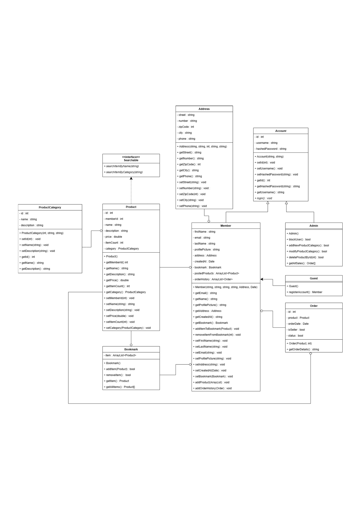

# E-Commerce Web Application
abiyoso danar panji
## Project Description
This is an e-commerce web application developed using JSP and Servlet technology, implementing the MVC (Model-View-Controller) design pattern. The application provides features for user account management, product browsing, cart management, and order logging. 

---

## Features
- User authentication (Admin, Member, Guest)
- Product browsing and search by category or name
- Order management (sold out product history)
- Bookmarking products for future reference
- Admin functionality for managing products and categories

---

## Todos
### Additional Todos

- [ ] **Design UI**  
    _Deadline: Tuesday, 20 May 2025_ — Upan & Hilmi
- [ ] **Update class diagram**  
    _Deadline: Sunday, 18 May 2025_ — Everyone
- [ ] **Create dummy data**  
    _Deadline: Monday, 19 May 2025_ — Abdullah
- [ ] **Develop views** (Start after dummy data is completed)  
    _Deadline: To be determined_ — Everyone

### Initial Setup
- [ ] Set up database connection (`DatabaseConnection.java`).

### Model Development
- [ ] Implement models: `Account`, `Member`, `Admin`, `Product`, `Order`, etc.

### Controller Development
- [ ] Develop `ProductController` for product-related actions.
- [ ] Develop `AccountController` for user authentication.
- [ ] Develop `OrderController` for order management.

### View Development
- [ ] Create JSP files for views: `index.jsp`, `product.jsp`, `cart.jsp`, etc.
- [ ] Add CSS and JavaScript for front-end styling and functionality.

### Testing
- [ ] Perform integration testing for servlets and views.

### Deployment
- [ ] Deploy the application to a server.

## Pembagian Tugas (View)

- **Abdullah:** Login, Register
- **Abi:** Product Info (Sell)
- **Fery:** Profile, Account
- **Beben:** Product Info (Buy)
- **Upan:** Beranda
- **Hilmi:** Admin

## Pembagian Tugas (Fitur)

- **Abdullah:** Database Connection, User Authentication (Admin, Member, Guest)
- **Abi:** _(Belum ditentukan)_
- **Fery:** _(Belum ditentukan)_
- **Beben:** _(Belum ditentukan)_
- **Upan:** _(Belum ditentukan)_
- **Hilmi:** _(Belum ditentukan)_
---